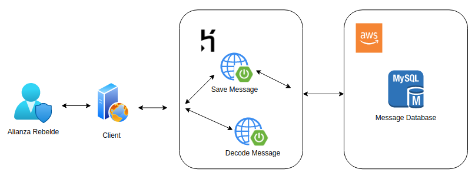
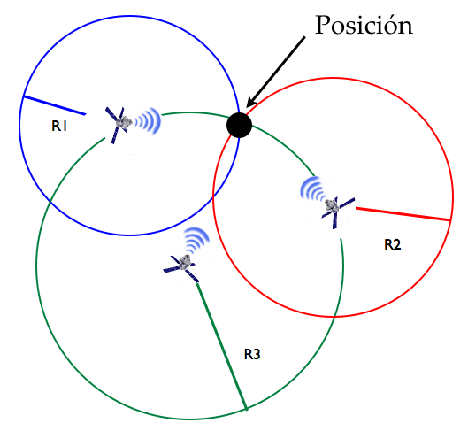
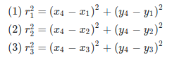
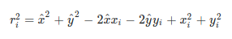
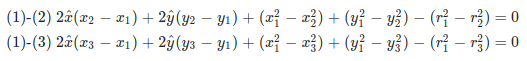

# SISTEMAS DE COMUNICACIONES ALIANZA REBELDE
# TABLA DE CONTENIDO

1. [MercadoLibre Challenge](#ml-challenge)
   1. [Arquitectura](#ARQ)
   2. [Tecnologías / Frameworks](#TECNO)
   3. [Detalle Solución](#SOL)
   4. [Instalación](#INSTALL)
   5. [Ejecución Pruebas Unitarias/Integración ](#TEST)
   6. 
   7. 
   8. 

# Arquitectura 

para el desarrollo del challenge se plantea la siguiente arquitectura:

# Tecnologías / Frameworks 

A continuación se listan las tecnologías y frameworks necesarios para la construcción de la solución al challenge:

   - Jdk 1.8
   - Spring Boot 2.4.4
   - Maven 3.6.3
   - MySQL 5.7.1
   - Swagger
   - Lombok
   - TestContainer
   - Junit
   - Mockito
   - Asserj
   - Owasp
   - Surefire
   - Failsafe
   - Docker
   - Heroku

# Detalle Solución 

Para el desarrollo del challenge fue necesario la aplicación del concepto de **Trilateración**:
>  que consiste en La trilateración es una técnica geométrica para determinar la posición de un objeto conociendo
   su distancia a tres puntos de referencia. A diferencia de la más conocida técnica de
   triangulación, en la que se miden ángulos y distancias, en la trilateración se utilizan sólo distancias. *Ref* [Trilateración](https://www.ugm.org.mx/publicaciones/geos/pdf/geos14-2/trilateracion-34-2.pdf)

El siguiente sistema de ecuaciones representa el cálculo de la trilateración para 3 satelites como en nuestro caso:

Básicamente expandimos las ecuaciones hasta tener la siguiente definición:

Y después poder realizar las operaciones necesarias entre ecuaciones para obtener las coordenadas de nuestra nave enemiga y así detemrinar su ubicacón en el espacio

# Instalación 

## Ejecución en línea

Para la ejecución de la solución se desplegó la aplicación en **Heroku** y que de esta manera esté disponible para su prueba en la siguiente url: 

   > *https://ml-challenge-2021.herokuapp.com/alliance/api/v1/*

adicional he agregado una collección de postman para su [Descarga](https://github.com/dev-io21/ml-challenge/blob/master/postman/ml-challenge.postman_collection.json) y probar los diferentes escenarios según la especificación del challenge.

## Ejecución local

Si lo que se quiere es ejecutar la solución de manera local he compilado una imagen docker y la he almacenado en [Docker Hub](https://hub.docker.com/repository/docker/wortiz1027/comunications-services)

clonamos el repositorio de la siguiente manera:
   
   >  *git clone https://github.com/dev-io21/ml-challenge.git*

ubicarnos en el repositorio descargado:

   > *cd ml-challenge*

Para facilitar la configuración y ejecución he prepado un [docker-compose](https://github.com/dev-io21/ml-challenge/blob/master/docker-compose.yml), como prerequisito solo tener instalado Docker y 
ejecutar el siguiente comando dentro del directorio raíz:

   > *docker-compose up*

# Ejecución Pruebas Unitarias/Integración 

Para ejecutar las pruebas unitarias se necesita tener instalado maven y configurado los binarios en la variable de entorno PATH del sistema operativo, una vez realidado esto
nos movemos a la raíz del repositorio clonado y ejecutamos los siguiente:

- Pruebas unitarias
   >  mvn clean test -P dev

- Pruebas de Integración
   >  mvn clean verify -P itest

- Pruebas de seguridad de las dependencias del proyecto
   >  mvn test org.owasp:dependency-check-maven:check

## Versiones

Para llevar un mejor control de los fuentes y su trazabilidad el equipo decidio utilizar repositorios git y [github](https://github.com/dev-io21/ml-challenge) para mantener centralizado

## Autores

* **Wilman Ortiz Navarro** - *Desarrolador Backend Senior*

## License

This project is licensed under the MIT License - see the [LICENSE.md](LICENSE.md) file for details